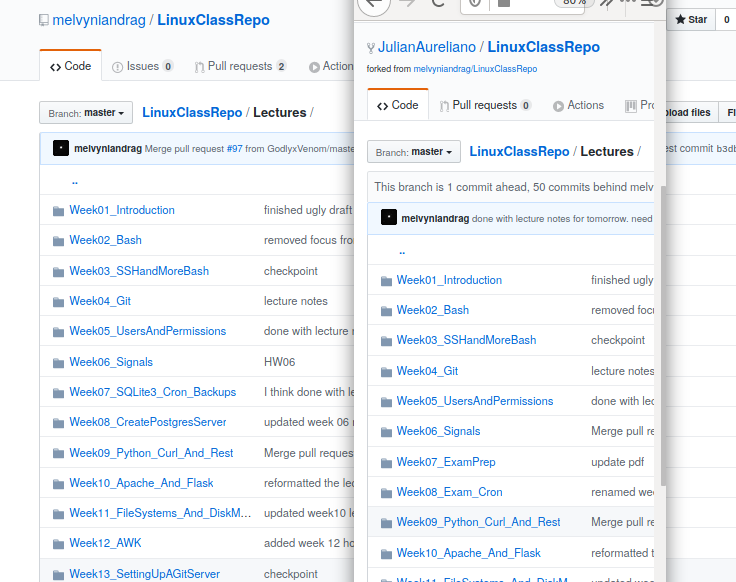
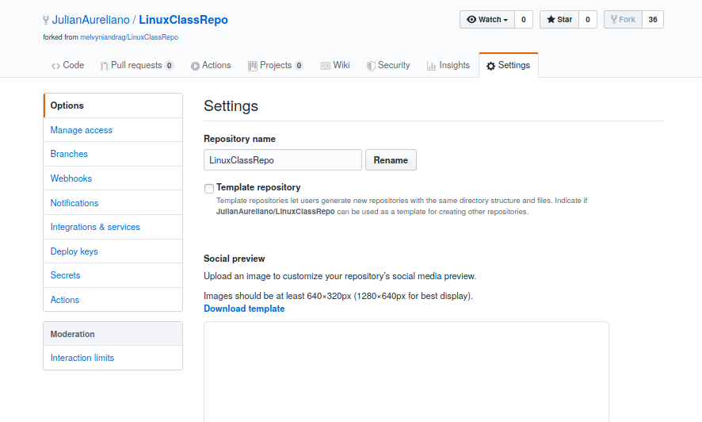
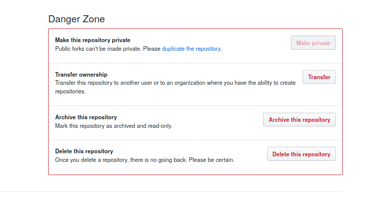
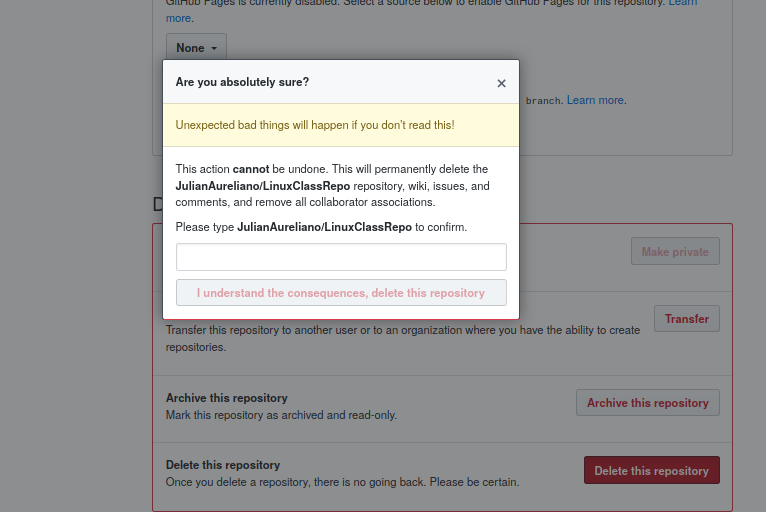

# Delete your Fork on Github

You might come across problems trying to make a pull request if you created your
fork a long time ago. Later in the semester I'll explain why; there is no time
for explaining now. As a work around, just delete your old fork. 

It's pretty easy, look at the pictures I took below.

## Step 1 - Notice your fork is very out of date
See how the folders in JulianAureliano/LinuxClassRepo are different from melvyniandrag/LinuxClassRepo ( melvyniandrag/LinuxClassRepo is on the left, JulianAureliano/LinuxClassRepo is on the right) ? For example, notice that the Week07 and Week08 directories are different? That's no good, the fork is way out of date.

## Step 2 - Click on Settings for your Fork

## Step 3 - Scroll to the Bottom of the Settings
When you scroll to the bottom, you'll see a red area marked 'Danger'.

## Step 4 - Click the Delete Button and Do What It Says
Click on the 'Delete this Repository' button. Instructions will pop up. Follow the instructions.

## Step 5 - Now You can Make a New Fork and Do a Successful Pull Request

Then you can create a pull request [as explained
here](https://www.youtube.com/watch?v=OyN39W7P4Mc).

